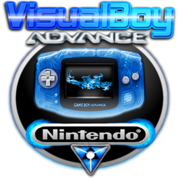
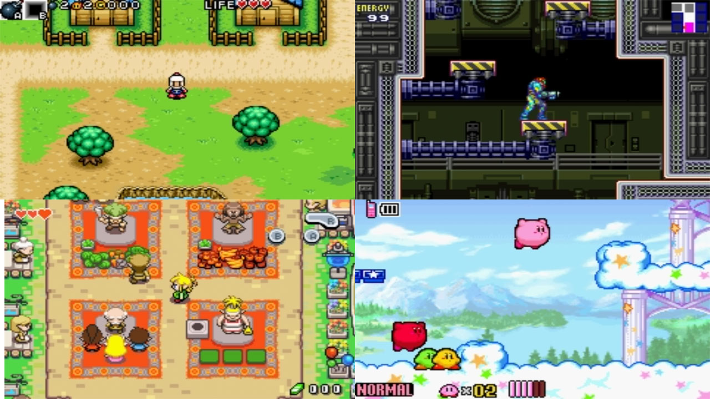

# Nintendo - Game Boy Advance (VBA-M)

### Description

VBA-M is a Nintendo Game Boy and Game Boy Advance emulator based on the official VisualBoyAdvance by Forgotten and the VBA development team.

### License

GPLv2

### Icon

### Fanart

Help make me fanart!

### Screenshots

